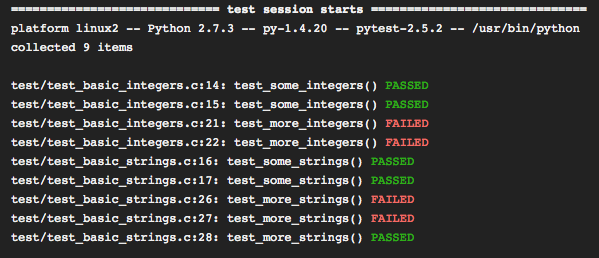

.. _index:

Pytest & C
==========

.. toctree::
   :hidden:

   c_unit_test.rst
   conftest.rst
   running.rst
   learn_more.rst

Using pytest as a testrunner for C unit tests
---------------------------------------------

This document shows how to use the Python ``pytest`` test tool to run unit
tests written in C.

Wait, what?
-----------

I'm going to show you how to run C unit tests using the Python test tool
``pytest``.

Are you sure that is a good idea?
---------------------------------

No. I'm pretty sure it isn't.

If you want to write and run C unit tests then there are a lot of better
alternatives such as
`Unity <http://throwtheswitch.org/white-papers/unity-intro.html>`_ or
`GoogleTest <https://code.google.com/p/googletest/>`_ (for C/C++ testing) or
`many others <http://en.wikipedia.org/wiki/List_of_unit_testing_frameworks#C>`_.

So, what is the use case?
-------------------------

Established C test frameworks are a better alternative when you are starting a
project from scratch. However, if you have existing C unit tests that you just
want to execute, then rewriting them to conform to a new framework probably
isn't worth the effort.

Equally, writing a testrunner that is flexible enough to run all or a subset
of the tests, that can output the results in JUnit or other formats, or that
can filter results into concise reports probably isn't worth the effort either.

In which case it would be better to use an existing testrunner that supports
all these features and that can be easily extended to capture the output from
existing C unit tests without having to modify them.

Why Pytest?
-----------

`Pytest <http://pytest.org/latest/index.html>`_ is a really nice Python testing
tool.

It has `good documentation <http://pytest.org/latest/contents.html#toc>`_,
clean code, lots of tests, a large but clear set of options for running tests
and collecting results and best of all it is easily extensible.

Okay. I'm still with you, but barely
------------------------------------

Then read on and I'll see if I can convince you with a working example.

So let's start with :ref:`c_unit`.
